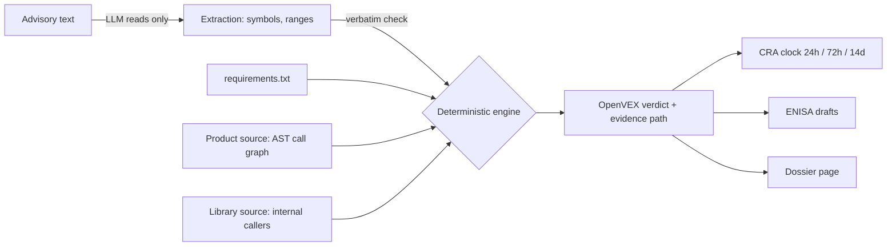

# T-24

**Prove whether you're affected before the CRA clock runs out.**

Since 11 September 2026, the EU Cyber Resilience Act (Article 14) gives manufacturers **24 hours** to send ENISA an early warning about an actively exploited vulnerability in their product, **72 hours** for a notification, and **14 days** for a final report. Fines reach **€15M or 2.5% of worldwide turnover**.

When an advisory drops, the first question is always *"are we even affected?"*. Teams answer it by grepping, reading advisories, and arguing, while the clock runs. Most alerts concern code the product never calls.

T-24 answers that question with code-level proof in seconds, then drafts everything the next 24 hours need: an OpenVEX statement, the ENISA early warning and notification, and a verified fix.

Built with **IBM Bob 2.0** for the IBM Bob 2.0 Hackathon.

**Live demo:** LIVE_URL (toggle *Before fix / After fix*)

---

## What it does



On the demo product, a small Flask service pinned to four real vulnerable libraries:

| Advisory | Library | Verdict | Proof |
|---|---|---|---|
| CVE-2020-14343 | PyYAML 5.3.1 | **Affected** | `demo_product/app.py:14 upload_config` → `demo_product/config.py:5 load_settings` → `yaml.full_load` |
| CVE-2023-50447 | Pillow 9.5.0 | **Not affected** | No path from any entry point reaches `PIL.ImageMath.eval`, and Pillow never calls it internally |
| CVE-2024-22195 | Jinja2 3.1.2 | **Not affected** | No template reachable from a route uses the `xmlattr` filter |
| CVE-2023-32681 | requests 2.30.0 | **Under investigation** | requests calls `rebuild_proxies` internally (`sessions.py:245`), so the app can reach it through `requests.post` |

Two alerts closed with proof and no emergency release. One real exposure found with its exact path. One honest "we can't prove it", with the reason.

## Trust rules

The model never decides anything.

1. **The LLM only reads.** It extracts symbols and preconditions from the advisory text. Any symbol that does not appear word for word in the advisory is dropped. Version ranges always come from the published advisory, never from the model.
2. **A deterministic engine decides.** Verdicts come only from `t24/verdict.py`, using the installed versions, an AST call graph of the product, and a scan of the library's own source.
3. **Soundness over completeness.** "Not affected" requires every file to parse, no dynamic access (`getattr`, `importlib`, star imports, module objects passed around), no product path to the symbol, and no internal caller inside the library. Anything else is "under investigation", with the reason.
4. **Every claim cites evidence.** Reports cite `file:line` or the advisory URL. Drafts are marked *for human review*; T-24 never submits to ENISA.

## Quickstart (about a minute, no API key)

Requires Python 3.11.

```bash
git clone https://github.com/Jonathan-Jesni/T-24.git
cd T-24
python -m venv .venv
.venv/bin/python -m pip install -e ".[dev]" -r demo_product/requirements.txt   # Windows: see demo_product/wheels/README.md
.venv/bin/python -m pytest -q
.venv/bin/python -m t24 scan demo_product --advisories advisories \
  --exploited CVE-2020-14343=2026-09-27T02:00:00Z --out out --offline
python -m http.server 8765   # then open http://127.0.0.1:8765/dossier/
```

`--offline` replays `cache/`, which holds real extractions from a live model call; each file records the provider, model, timestamp, and raw response. To call a model yourself, put `FIREWORKS_API_KEY` (or `WATSONX_APIKEY`, `WATSONX_PROJECT_ID`, `WATSONX_URL` for IBM Granite) in `.env` and drop `--offline`.

### The fix, red to green

The branch `fix/CVE-2020-14343` holds the fix Bob produced with the `cra-triage` skill. Its regression test posts a real CVE-2020-14343 payload to `/upload-config`:

- on `main` (vulnerable) the app returns `["EXPLOITED-42"]`, and the test **fails**;
- on the fix branch (`yaml.safe_load`, HTTP 400 on bad YAML, PyYAML 6.0.2) the test **passes**;
- rescanning with `--baseline` marks the finding **fixed**, and the CRA clock keeps running, because reporting is still owed after a patch.

## How IBM Bob built it

T-24 was built across seven Bob tasks by two developers; every task summary is in [`bob_sessions/`](bob_sessions/).

- **Plan mode** designed the architecture, the rules in [`AGENTS.md`](AGENTS.md), and the data contract between the engine and the page.
- **Agent mode with parallel subagents** built the demo product, fetched the advisories, and wrote the engine test-first: 166 tests.
- **Adversarial review loops.** A reviewer attacked the reachability engine with 19 tricky projects; Bob fixed every false "not reached" and wrote each case into the test suite.
- **Custom mode** [`CRA Incident Commander`](.bob/custom_modes.yaml) restricts edits to `demo_product/` and `out/` and forbids stating any verdict the dossier doesn't contain.
- **Skill** [`cra-triage`](.bob/skills/cra-triage/SKILL.md) runs the whole incident: scan, failing regression test, fix, passing test, rescan, and questions for anything unproven.

Details: [`docs/BOB_WORKFLOW.md`](docs/BOB_WORKFLOW.md). Three small formatting fixes after the first live model run were made outside Bob.

## Limits

T-24 analyses Python products. Method calls are over-approximated (any method with the same name counts), so it can flag "affected" too eagerly, never too leniently. Library-internal callers are checked one level deep. See [`docs/REACHABILITY.md`](docs/REACHABILITY.md).

## Data

Advisories come from the GitHub Advisory Database (CC BY 4.0), fetched and stored verbatim with personal data removed; sources are listed in [`docs/DATA_SOURCES.md`](docs/DATA_SOURCES.md).

## License

MIT, see [`LICENSE`](LICENSE).
